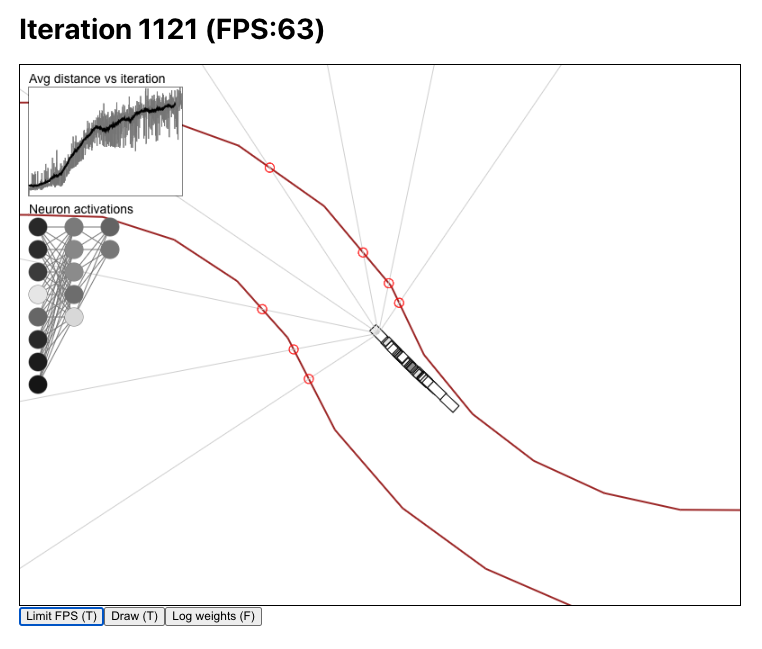

# Car-neural

This is my "2d car - AI - neural network - evolution algorithm" project.

The neural network gets distances to the road at certain angles as an input. It outputs the steering direction and the desired speed. Initially the neural network is initialized randomly. 

At each iteration the cars start at the starting position and they run until they hit a wall or the maximum time limit is reached.

After an iteration the worst performing cars are discarded and the best performing cars continue to the next iteration. The worst performing cars are replaced by varied versions of the better performing ones. The variation is done so that the neural netowrks weights are slightly modified randomly. Over time this leads to the car "brain" evolving into performing better.

The project is written in typescript and uses canvas element to draw the cars on the browser.

There are certain helper classes such as:

 * `Vector` helps with vector math that is required for the car movement and collision detection
 * `Line` Implements the code for collision detection
 * `NeuralNet` Basic implementation of simple neural network. No backpropagation is implemented since it is not required for the evolution algorithm
 * `Car` Handles the car movement, vision and collision detection tasks
 
The road is procedurally generated so that it gets harder towards the end. That it achieved by making the road narrower and the corners sharper towards the end. It is re randomized after each iteration to promote the model to generalize better instead of learning to drive just one specific road.

## Screenshoting it

## Gif

## How to run

`npm start`

(This project was bootstrapped with [Create React App](https://github.com/facebook/create-react-app).)

